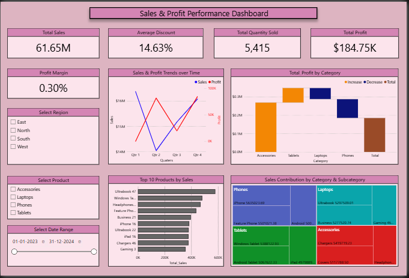

# Sales Dashboard – October 2025

[📊 View Dashboard PDF](Sales_Analysis_Dashboard.pdf)

---

## 🧠 Project Overview
The **Sales Dashboard** is an interactive Power BI report designed to analyze company sales performance for October 2025.  
It provides insights into sales trends, top-performing products, and regional performance, enabling data-driven decision-making.

---

## ✨ Key Insights & Features
- **Revenue Tracking:** Breakdown of total revenue by week and month.  
- **Top Products:** Identify best-selling items and categories.  
- **Regional Performance:** Compare sales across different geographic areas.  
- **Interactive Filters:** Filter data by region, category, or time period.  

---

## 📂 Data Sources
| File Name | Description |
|------------|-------------|
| [Orion_Sales_Data.csv](Orion_Sales_Data.csv) | Contains product-level sales data (quantity, revenue, region). |

> ⚠️ Note: This dataset is for demonstration purposes only.

---

## ⚙️ How to Use
1. Open the [Sales_Analysis_Dashboard.pdf](Sales_Analysis_Dashboard.pdf) file to view the dashboard.  
2. Explore `Orion_Sales_Data.csv` if you want to re-create or analyze data in Power BI.  
3. View [Sales Dashboard Preview](Sales_Analysis_Dashboard.png) below for a quick visual summary.

---

## 📸 Dashboard Preview

---

## 🧩 Skills & Tools Demonstrated
- Data cleaning and transformation in **Power BI**  
- DAX calculations and KPI cards  
- Building interactive visuals  
- Dashboard design with consistent layout and colors  

---

## 🧑‍💻 Author
**Anshumaan Mishra**  
📂 GitHub: (https://github.com/mi9Ans)  
🔗 LinkedIn: (https://www.linkedin.com/in/anshumaan-mishra-211118365/))
